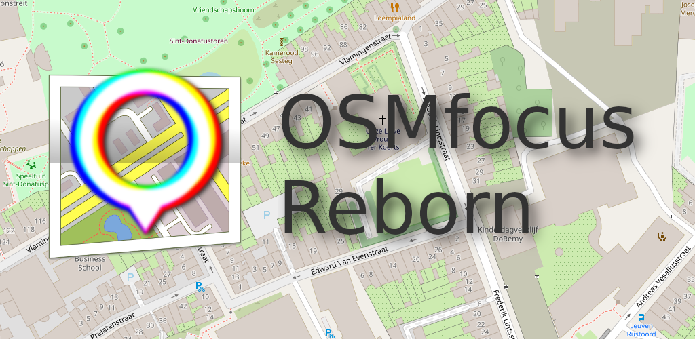

**Fork Notice**

This app is a complete re-write of the now (07-11-2020) defunct OSMfocus by Network42 / MichaelVL.
Google Play: https://play.google.com/store/apps/details?id=dk.network42.osmfocus GitHub: https://github.com/MichaelVL/osm-focus

# OSMfocus Reborn

  

OSMfocus Reborn is an open source tool for examining OpenStreetMap elements by moving around on a map.
Written in Kotlin using Android Jetpack.

Move the crosshair in the middle of the map over a building or road to view its keys and values. A line will be drawn connecting the element with a box on the side of the screen. This box contains every tag of the element in OpenStreetMap. Use this information to find bugs or to investigate an area closer. Click on one of the boxes if you want even more detailed information.

Change the basemap (background layer) or add your own by going to the settings screen (cog icon).

 

## Source, issue tracking and more info

Visit [https://github.com/ubipo/osmfocus](https://github.com/ubipo/osmfocus)

Other stuff by me: [https://pfiers.net](https://pfiers.net)

## Notices

OSMfocus Reborn allows you to view OpenStreetMap data. This data is [© (Copyright) OpenStreetMap contributors](https://www.openstreetmap.org/copyright) and is available under the [Open Database License](https://opendatacommons.org/licenses/odbl/).

OSMfocus Reborn uses (remixed) names and ideas from OSMfocus (MichaelVL) v0.1.1r1, which is available under the ["Apache License 2.0"](https://github.com/MichaelVL/osm-focus/blob/master/LICENSE).

OSMfocus Reborn uses a remixed version of the OpenStreetMap logo, as per the [Trademark Policy §3.5](https://wiki.osmfoundation.org/wiki/Trademark_Policy).

OSMfocus Reborn allows you to view map tiles from (but does not rely on) third-party and potentially non-free services.
