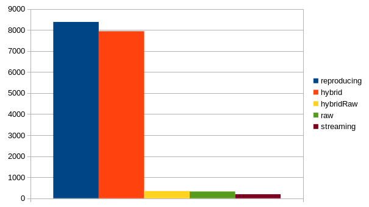

# OSM API Parsing Performance Tests

## Results

```text
[
    PerfResult(reproducing=8989, raw=333, streaming=215, hybrid=8448, hybridRaw=360),
    PerfResult(reproducing=8351, raw=313, streaming=190, hybrid=7996, hybridRaw=342),
    PerfResult(reproducing=8197, raw=327, streaming=188, hybrid=8347, hybridRaw=342),
    PerfResult(reproducing=8277, raw=326, streaming=184, hybrid=8101, hybridRaw=347),
    PerfResult(reproducing=8245, raw=323, streaming=193, hybrid=7468, hybridRaw=337),
    PerfResult(reproducing=8246, raw=326, streaming=188, hybrid=7302, hybridRaw=338)
]
```

## Averages

```text
reproducing  8384
hybrid       7943
hybridRaw    344
raw          324
streaming    193
```


